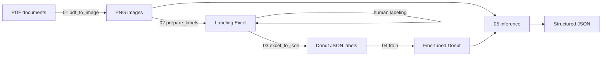

# Donut Document AI — Korean Transaction-Statement Parser

End-to-end document parsing for Korean transaction statements (거래명세표 / 계산서)
built on [Donut](https://github.com/clovaai/donut) (`naver-clova-ix/donut-base`).
The model reads a document **image** and directly outputs **structured JSON** —
no OCR + rule engine in between.

```
PDF ──▶ PNG ──▶ Donut (Swin encoder + mBART decoder) ──▶ JSON fields
```

This repository refactors an original capstone notebook pipeline into a
configurable, scriptable package.



---

## Why end-to-end (Donut) over OCR + templates

An earlier version of this project used a classic CV/OCR pipeline
(PDF → image → ORB template alignment → per-field Tesseract OCR). It was brittle:
every new store layout needed new alignment templates and field boxes. Donut
replaces that with a single image-to-sequence model that learns the layout +
field semantics jointly, so new layouts only need labeled examples, not code.

## Output schema

Fields are grouped by prefix:

| Group | Fields |
|-------|--------|
| `서류특성.*` | 서류종류, 거래일, 합계금액 |
| `피공급자.*` | 이름, 거래전미지급금, 입금액, 현잔액 |
| `품목.*` | 품목명, 코드, 단위, 수량, 단가, 공급가액, 세액, 수량합계, 공급가액합계, 세액합계 |

`입고서류` (incoming-goods) documents have no line items, so item-level
`품목.*` fields are dropped automatically during label generation.

## Project layout

```
donut-document-ai/
├── configs/default.yaml        # paths, hyperparameters, field schema
├── src/donut_docai/
│   ├── config.py               # YAML -> dataclass
│   ├── data/
│   │   ├── pdf_to_image.py      # PDF -> PNG (first page, configurable DPI)
│   │   ├── filename_to_excel.py # seed label workbook with filenames
│   │   └── excel_to_json.py     # labeled Excel -> Donut JSON
│   ├── dataset.py              # JSON + image -> HF Dataset + preprocessing
│   ├── train.py                # Seq2SeqTrainer fine-tuning
│   └── inference.py            # load model, predict, parse JSON
└── scripts/                    # 01..05 CLI entry points
```

## Install

Requires Python 3.9+ and the [poppler](https://github.com/oschwartz10612/poppler-windows)
binaries on PATH (for `pdf2image`). A CUDA GPU is strongly recommended for training.

```bash
pip install -e .
# or: pip install -r requirements.txt
```

## Workflow

All steps read `configs/default.yaml`; any path can be overridden via flags.

```bash
# 1. Render PDFs to PNG
python scripts/01_pdf_to_image.py --config configs/default.yaml

# 2. Seed the labeling workbook with filenames (then fill in fields by hand)
python scripts/02_prepare_labels.py

# 3. Convert the labeled Excel into Donut JSON labels
python scripts/03_excel_to_json.py

# 4. Fine-tune Donut  (place matching <name>.png next to each <name>.json)
python scripts/04_train.py

# 5. Run inference over a folder of images (local dir or HF repo id)
python scripts/05_inference.py --model ksk00/donut-docai
```

### Programmatic use

```python
from donut_docai import load_config
from donut_docai.inference import DonutPredictor

cfg = load_config("configs/default.yaml")
predictor = DonutPredictor(cfg, model_path="outputs/donut_finetuned")
raw, parsed = predictor.predict("data/images/sample.png")
print(parsed)
```

## Model weights

Fine-tuned weights are **not** committed (see `.gitignore`). Publish them to the
Hugging Face Hub and load by repo id:

```python
predictor = DonutPredictor(cfg, model_path="ksk00/donut-docai")
```

Published model: **[ksk00/donut-docai](https://huggingface.co/ksk00/donut-docai)**

First time using Hugging Face? Follow [`docs/huggingface_upload.md`](docs/huggingface_upload.md),
then upload with:

```bash
python scripts/upload_to_hf.py --model-dir <local-model> --repo-id <user>/donut-docai
```

## Training configuration

| Setting | Value |
|---------|-------|
| Base model | `naver-clova-ix/donut-base` (Swin-B encoder + mBART decoder) |
| Image size | 720 × 960 |
| Task prompt | `<s_gt_parse>` |
| Optimizer | AdamW, lr 5e-5, weight decay 0.01, warmup 5% |
| Epochs | 15, batch size 1, fp16, gradient checkpointing |
| Max sequence length | 512 |

## Results

Training converges cleanly — cross-entropy loss drops from ~7.7 to ~0.3 with
train and validation curves tracking closely:


On shorter runs / smaller label sets the validation loss plateaus while training
loss keeps falling — the overfitting signal that motivates the limitations below:


## Known limitations

This was trained on a **small** in-house dataset (tens of documents). With so few
examples the model overfits and can collapse into repeated tokens on unseen
layouts (e.g. `"액액액..."`). Honest next steps to improve it:

- Collect more labeled documents per store layout.
- Augment images (rotation, blur, brightness) for robustness.
- Add field-level evaluation (exact match / tree-edit distance) instead of eyeballing.
- Constrain decoding to the known field schema.

## Acknowledgements

- [Donut: OCR-free Document Understanding Transformer](https://arxiv.org/abs/2111.15664) (Kim et al., 2022)
- `naver-clova-ix/donut-base` on the Hugging Face Hub
