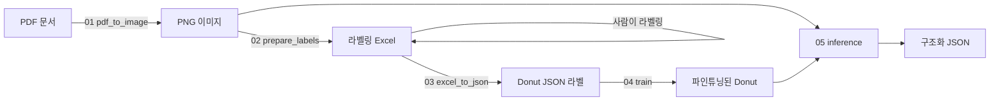

# Donut Document AI — 거래명세표/계산서 파서

[Donut](https://github.com/clovaai/donut)(`naver-clova-ix/donut-base`) 기반의
End-to-End 문서 파싱 프로젝트. 한국어 거래명세표·계산서 **이미지**를 입력받아
중간 OCR·규칙엔진 없이 **구조화된 JSON**을 바로 출력한다.

```
PDF ──▶ PNG ──▶ Donut (Swin 인코더 + mBART 디코더) ──▶ JSON 필드
```

원본 캡스톤 노트북 파이프라인을, 설정 가능하고 스크립트로 실행되는 패키지로
리팩터링한 저장소다.



---

## 왜 OCR+템플릿이 아니라 End-to-End(Donut)인가

초기 버전은 전통적인 CV/OCR 파이프라인(PDF → 이미지 → ORB 템플릿 정렬 →
필드별 Tesseract OCR)을 썼다. 매장 양식이 바뀔 때마다 정렬 템플릿과 필드 박스를
새로 만들어야 해서 깨지기 쉬웠다. Donut은 이를 단일 image-to-sequence 모델로
대체한다. 레이아웃과 필드 의미를 함께 학습하므로, 새 양식은 코드가 아니라
**라벨링된 예시**만 추가하면 된다.

## 출력 스키마

필드는 접두사로 그룹화된다.

| 그룹 | 필드 |
|-------|--------|
| `서류특성.*` | 서류종류, 거래일, 합계금액 |
| `피공급자.*` | 이름, 거래전미지급금, 입금액, 현잔액 |
| `품목.*` | 품목명, 코드, 단위, 수량, 단가, 공급가액, 세액, 수량합계, 공급가액합계, 세액합계 |

`입고서류`는 품목 라인이 없으므로, 라벨 생성 시 `품목.*` 필드를 자동 제외한다.

## 프로젝트 구조

```
donut-document-ai/
├── configs/default.yaml        # 경로, 하이퍼파라미터, 필드 스키마
├── src/donut_docai/
│   ├── config.py               # YAML -> dataclass 로더
│   ├── data/
│   │   ├── pdf_to_image.py      # PDF -> PNG (첫 페이지, DPI 설정 가능)
│   │   ├── filename_to_excel.py # 라벨링 워크북에 파일명 시드
│   │   └── excel_to_json.py     # 라벨링 Excel -> Donut JSON
│   ├── dataset.py              # JSON + 이미지 -> HF Dataset + 전처리
│   ├── train.py                # Seq2SeqTrainer 파인튜닝
│   └── inference.py            # 모델 로드, 예측, JSON 파싱
└── scripts/                    # 01~05 CLI 진입점
```

## 설치

Python 3.9 이상, 그리고 `pdf2image`가 쓰는 [poppler](https://github.com/oschwartz10612/poppler-windows)
바이너리가 PATH에 있어야 한다. 학습에는 CUDA GPU를 강력히 권장한다.

```bash
pip install -e .
# 또는: pip install -r requirements.txt
```

## 실행 흐름

모든 단계는 `configs/default.yaml`을 읽으며, 경로는 플래그로 덮어쓸 수 있다.

```bash
# 1. PDF를 PNG로 렌더링
python scripts/01_pdf_to_image.py --config configs/default.yaml

# 2. 라벨링 워크북에 파일명 채우기 (이후 사람이 필드 값 입력)
python scripts/02_prepare_labels.py

# 3. 라벨링된 Excel을 Donut JSON 라벨로 변환
python scripts/03_excel_to_json.py

# 4. Donut 파인튜닝 (각 <이름>.json 옆에 같은 이름의 <이름>.png 배치)
python scripts/04_train.py

# 5. 이미지 폴더에 대해 추론 (로컬 경로 또는 HF repo id)
python scripts/05_inference.py --model ksk00/donut-docai
```

### 코드로 직접 사용

```python
from donut_docai import load_config
from donut_docai.inference import DonutPredictor

cfg = load_config("configs/default.yaml")
predictor = DonutPredictor(cfg, model_path="outputs/donut_finetuned")
raw, parsed = predictor.predict("data/images/sample.png")
print(parsed)
```

## 모델 가중치

파인튜닝 가중치는 git에 커밋하지 않는다(`.gitignore` 참고). Hugging Face Hub에
올린 뒤 repo id로 불러온다.

```python
predictor = DonutPredictor(cfg, model_path="ksk00/donut-docai")
```

공개 모델: **[ksk00/donut-docai](https://huggingface.co/ksk00/donut-docai)**

Hugging Face가 처음이라면 [`docs/huggingface_upload.md`](docs/huggingface_upload.md)
가이드를 따른 뒤 업로드한다.

```bash
python scripts/upload_to_hf.py --model-dir <로컬-모델-경로> --repo-id <사용자명>/donut-docai
```

## 학습 설정

| 항목 | 값 |
|---------|-------|
| 베이스 모델 | `naver-clova-ix/donut-base` (Swin-B 인코더 + mBART 디코더) |
| 이미지 크기 | 720 × 960 |
| Task 프롬프트 | `<s_gt_parse>` |
| 옵티마이저 | AdamW, lr 5e-5, weight decay 0.01, warmup 5% |
| 에폭 | 15, 배치 크기 1, fp16, gradient checkpointing |
| 최대 시퀀스 길이 | 512 |

## 결과

학습이 안정적으로 수렴한다. Cross-entropy 손실이 약 7.7에서 0.3까지 떨어지고
train·validation 곡선이 가깝게 따라간다.


학습 step이 짧거나 라벨 수가 적은 경우, train 손실은 계속 떨어지는데 validation
손실은 정체된다. 아래 한계 항목으로 이어지는 과적합 신호다.


## 알려진 한계

소량의 자체 데이터(문서 수십 건)로 학습했다. 예시가 적어 모델이 과적합하고,
처음 보는 양식에서는 같은 토큰을 반복하며 붕괴할 수 있다(예: `"액액액..."`).
솔직한 개선 방향은 다음과 같다.

- 매장 양식별로 라벨링 문서를 더 수집한다.
- 이미지 증강(회전·블러·밝기)으로 강건성을 높인다.
- 눈으로 보는 대신 필드 단위 평가(exact match / tree-edit distance)를 추가한다.
- 디코딩을 알려진 필드 스키마로 제약한다.

## 참고

- [Donut: OCR-free Document Understanding Transformer](https://arxiv.org/abs/2111.15664) (Kim et al., 2022)
- Hugging Face Hub의 `naver-clova-ix/donut-base`
