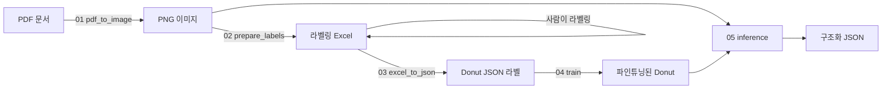
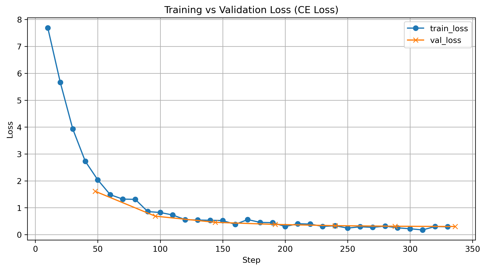
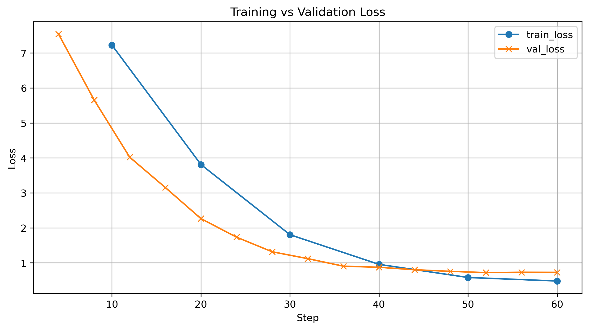

# 🧾 Donut Document AI — 거래명세표/계산서 End-to-End 파서

> **OCR·규칙엔진 없이, 문서 이미지를 입력받아 구조화 JSON을 바로 출력하는 End-to-End 문서 이해 모델 (Donut 파인튜닝)**


> 성결대 2025-1 캡스톤 디자인 / 거래명세표·계산서 자동 디지털화 프로젝트

## 💡 프로젝트 개요 (Overview)

본 프로젝트는 한국어 거래명세표·계산서(반정형 문서)를 **사람의 수작업 입력 없이
구조화 데이터(JSON)로 자동 변환**하는 문서 이해 솔루션입니다.

초기에는 전통적 CV/OCR 파이프라인(PDF → 이미지 → ORB 템플릿 정렬 → 필드별
Tesseract OCR)으로 접근했으나, **매장 양식이 바뀔 때마다 정렬 템플릿과 필드
박스를 새로 만들어야 하는 구조적 한계**에 부딪혔습니다. 이를 [Donut](https://github.com/clovaai/donut)
(`naver-clova-ix/donut-base`) 기반의 단일 image-to-sequence 모델로 전환하여,
레이아웃과 필드 의미를 함께 학습하도록 재설계했습니다. 새 양식은 코드가 아니라
**라벨링된 예시만 추가**하면 대응됩니다.

```
PDF ──▶ PNG ──▶ Donut (Swin 인코더 + mBART 디코더) ──▶ 구조화 JSON
```



## 🎯 핵심 문제 & 차별점 (Problem & Approach)

| 항목 | 내용 |
|------|------|
| 대상 문서 | 한국어 거래명세표·계산서 (매장별 양식 상이, 반정형) |
| 기존 방식 한계 | OCR+템플릿은 양식마다 정렬 좌표·필드 박스를 수작업 정의 → 확장성 부재 |
| 채택 접근 | **Donut End-to-End** — 이미지에서 JSON 시퀀스를 직접 생성, OCR 불필요 |
| 도메인 처리 | `입고서류`는 품목 라인이 없어 `품목.*` 필드를 라벨 생성 시 자동 제외 |

## 🧠 모델 아키텍처 (Model Architecture)

- **인코더**: Swin Transformer (`donut-base`) — 문서 이미지를 패치 단위로 인코딩
- **디코더**: mBART — `<s_gt_parse>` 프롬프트에서 시작해 JSON 토큰 시퀀스를 자기회귀 생성
- **출력 후처리**: 생성 문자열을 파싱하여 `dict`로 복원

### 출력 스키마

| 그룹 | 필드 |
|-------|--------|
| `서류특성.*` | 서류종류, 거래일, 합계금액 |
| `피공급자.*` | 이름, 거래전미지급금, 입금액, 현잔액 |
| `품목.*` | 품목명, 코드, 단위, 수량, 단가, 공급가액, 세액, 수량합계, 공급가액합계, 세액합계 |

## 📂 저장소 구조 (Repository Structure)

원본 캡스톤 노트북을, 설정 기반으로 재실행 가능한 모듈형 패키지로 리팩터링했습니다.

```text
donut-document-ai/
├── configs/default.yaml        # 경로·하이퍼파라미터·필드 스키마 (단일 설정원)
├── src/donut_docai/
│   ├── config.py               # YAML -> dataclass 로더
│   ├── data/
│   │   ├── pdf_to_image.py      # PDF -> PNG (첫 페이지, DPI 설정 가능)
│   │   ├── filename_to_excel.py # 라벨링 워크북에 파일명 시드
│   │   └── excel_to_json.py     # 라벨링 Excel -> Donut JSON
│   ├── dataset.py              # JSON + 이미지 -> HF Dataset + 전처리
│   ├── train.py                # Seq2SeqTrainer 파인튜닝
│   └── inference.py            # 모델 로드 · 예측 · JSON 파싱
├── scripts/                    # 01~05 단계별 CLI 진입점
└── notebooks/                  # 원본 실험 노트북 (익명화·출력 제거)
```

## ⚙️ 설치 (Installation)

Python 3.9 이상과 `pdf2image`가 사용하는 [poppler](https://github.com/oschwartz10612/poppler-windows)
바이너리(PATH 등록)가 필요하며, 학습에는 CUDA GPU를 권장합니다.

```bash
pip install -e .
# 또는: pip install -r requirements.txt
```

## 🚀 실행 흐름 (Workflow)

모든 단계는 `configs/default.yaml`을 읽으며, 경로는 플래그로 덮어쓸 수 있습니다.

```bash
# 1. PDF를 PNG로 렌더링
python scripts/01_pdf_to_image.py --config configs/default.yaml

# 2. 라벨링 워크북에 파일명 채우기 (이후 사람이 필드 값 입력)
python scripts/02_prepare_labels.py

# 3. 라벨링된 Excel을 Donut JSON 라벨로 변환
python scripts/03_excel_to_json.py

# 4. Donut 파인튜닝 (각 <이름>.json 옆에 같은 이름의 <이름>.png 배치)
python scripts/04_train.py

# 5. 이미지 폴더에 대해 추론 (로컬 경로 또는 HF repo id)
python scripts/05_inference.py --model ksk00/donut-docai
```

### 코드로 직접 사용

```python
from donut_docai import load_config
from donut_docai.inference import DonutPredictor

cfg = load_config("configs/default.yaml")
predictor = DonutPredictor(cfg, model_path="ksk00/donut-docai")
raw, parsed = predictor.predict("data/images/sample.png")
print(parsed)
```

## 🤗 모델 가중치 (Model Weights)

파인튜닝 가중치는 용량이 커 git에 커밋하지 않고 Hugging Face Hub에 호스팅합니다.

- 공개 모델: **[ksk00/donut-docai](https://huggingface.co/ksk00/donut-docai)**
- 업로드 방법은 [`docs/huggingface_upload.md`](docs/huggingface_upload.md) 참고

```bash
python scripts/upload_to_hf.py --model-dir <로컬-모델-경로> --repo-id <사용자명>/donut-docai
```

## 🔧 학습 설정 (Training Configuration)

| 항목 | 값 |
|---------|-------|
| 베이스 모델 | `naver-clova-ix/donut-base` (Swin-B 인코더 + mBART 디코더) |
| 이미지 크기 | 720 × 960 |
| Task 프롬프트 | `<s_gt_parse>` |
| 옵티마이저 | AdamW, lr 5e-5, weight decay 0.01, warmup 5% |
| 에폭 | 15, 배치 크기 1, fp16, gradient checkpointing |
| 최대 시퀀스 길이 | 512 |

## 📊 결과 (Results)

학습이 안정적으로 수렴하여 cross-entropy 손실이 약 **7.7 → 0.3**까지 감소했으며,
train·validation 곡선이 가깝게 따라가는 정상 학습 패턴을 보였습니다.



다만 학습 step이 짧거나 라벨 수가 적은 경우, train 손실은 계속 떨어지는데
validation 손실은 정체되는 과적합 신호가 관찰되었습니다(아래 한계 항목 참고).



## ⚠️ 한계 및 개선 방향 (Limitations & Future Work)

소량의 자체 데이터(문서 수십 건)로 학습하여, 예시가 적은 탓에 모델이 과적합하고
처음 보는 양식에서는 같은 토큰을 반복하며 붕괴하는 현상(예: `"액액액..."`)이
나타났습니다. 솔직한 개선 방향은 다음과 같습니다.

- **데이터 확충**: 매장 양식별 라벨링 문서를 추가 수집
- **데이터 증강**: 회전·블러·밝기 변형으로 강건성 강화
- **정량 평가 도입**: 필드 단위 평가(exact match / tree-edit distance) 추가
- **제약 디코딩**: 출력을 알려진 필드 스키마로 제약하여 붕괴 방지

## 📚 참고 (References)

- [Donut: OCR-free Document Understanding Transformer](https://arxiv.org/abs/2111.15664) (Kim et al., 2022)
- Hugging Face Hub의 `naver-clova-ix/donut-base`
